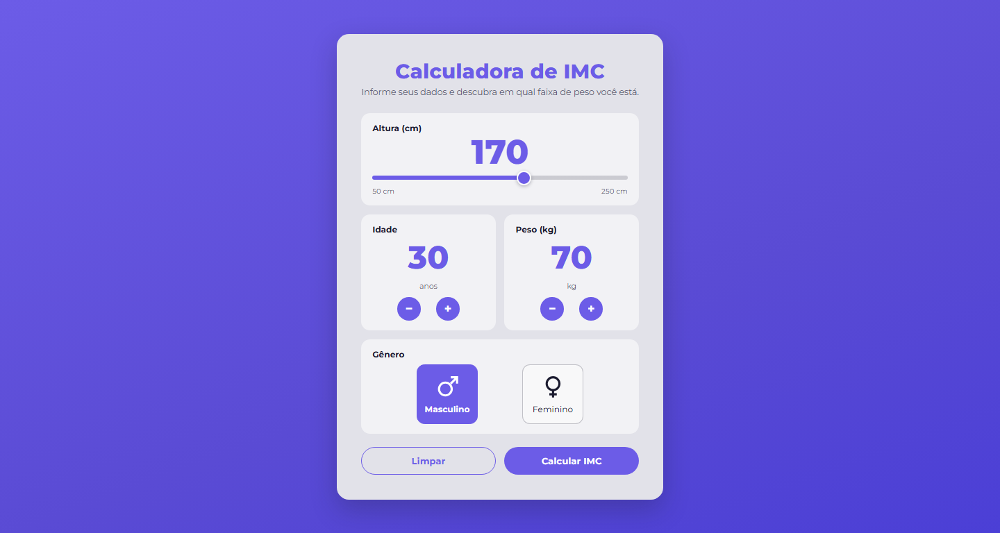

# Calculadora de IMC

Aplicação em React + Vite que calcula o Índice de Massa Corporal a partir de altura,
peso, idade e gênero, mostra a classificação segundo a tabela da OMS e guarda um
histórico dos últimos cálculos no navegador.



## Funcionalidades

- Altura definida por slider de 50 a 250 cm, com preenchimento proporcional ao valor
- Idade e peso ajustados por botões `−` / `+` ou digitados diretamente
- Seleção de gênero (masculino / feminino)
- Cálculo do IMC e classificação automática na faixa correspondente
- Faixa de peso ideal para a altura informada e quantos quilos faltam ou sobram
- Estimativa do gasto energético basal pela fórmula de Mifflin-St Jeor
- Tabela da OMS com a linha do resultado destacada
- Histórico de até 8 cálculos salvos em `localStorage`, com opção de apagar
- Validação dos campos com mensagem de erro
- Layout responsivo, foco visível pelo teclado e suporte a `prefers-reduced-motion`

## Como rodar

Requer Node.js 20 ou superior.

```bash
npm install
npm run dev
```

O Vite mostra o endereço local no terminal (por padrão `http://localhost:5173`).


## Estrutura

```
src/
├── App.jsx                  # estado geral, cálculo e histórico
├── App.css                  # layout da página e do cartão principal
├── index.css                # variáveis de cor e reset
├── main.jsx
├── components/
│   ├── Button.jsx           # botão reutilizável (primário / secundário)
│   ├── GeneroSelect.jsx     # seleção de gênero com ícones SVG
│   ├── Historico.jsx        # lista de cálculos salvos
│   ├── ImcCalc.jsx          # formulário de entrada
│   ├── ImcTable.jsx         # tela de resultado e tabela da OMS
│   └── Stepper.jsx          # campo numérico com − / +
├── data/
│   └── data.js              # faixas de classificação do IMC
└── utils/
    └── imc.js               # funções de cálculo, sem dependência de UI
```

A lógica fica isolada em `utils/imc.js`, então os componentes só cuidam de
apresentação e estado.

## Como o cálculo funciona

O IMC é o peso em quilos dividido pelo quadrado da altura em metros:

```
IMC = peso / altura²
```

| IMC             | Classificação    | Obesidade |
| --------------- | ---------------- | --------- |
| Menor que 18,5  | Magreza          | Grau 0    |
| Entre 18,5 e 24,9 | Normal         | Grau 0    |
| Entre 25,0 e 29,9 | Sobrepeso      | Grau I    |
| Entre 30,0 e 39,9 | Obesidade      | Grau II   |
| Maior que 40,0  | Obesidade grave  | Grau III  |

A faixa de peso ideal vem da mesma fórmula invertida, usando os limites 18,5 e 24,9.
O gasto basal usa Mifflin-St Jeor: `10 × peso + 6,25 × altura − 5 × idade`, somando 5
para o gênero masculino e subtraindo 161 para o feminino.

## Personalização

As cores ficam em variáveis CSS no topo de `src/index.css`:

```css
:root {
  --roxo: #6c5ce7;
  --roxo-escuro: #4b3fd6;
  --cartao: #e2e2e9;
  --texto: #1b1b2f;
  --texto-suave: #5b5b73;
}
```
